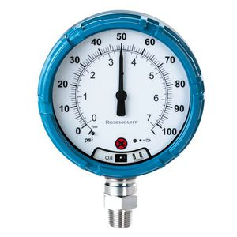

# Analog_Gauge_Images_Reader
A simple Analog Gauge Reader from the Gauge images using python3 and OpenCV library
## Requirement
* Python3
* OpenCV
* Images sample in images folder
## How to run
Select the image of analog gauge  
For example, image file: 3.jpg  

